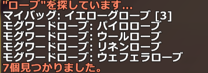
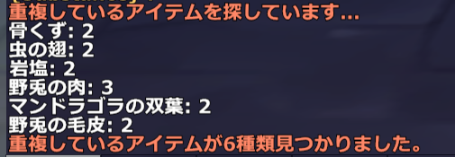
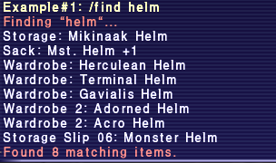
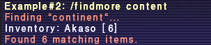
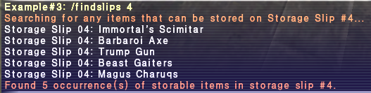
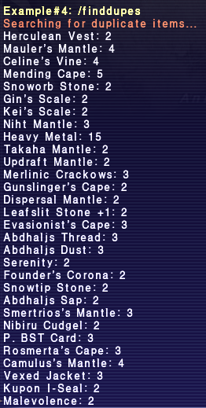
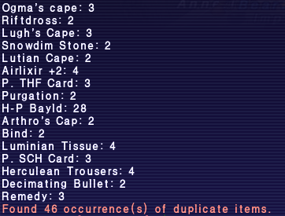

# find

Ashita v4 向けの日本語対応版です。スラッシュコマンドで、所持品の保管場所からアイテムを探せます。

本家は [Ashita の find](https://git.ashitaxi.com/Addons/find) です。このフォークは日本人向けに、検索と表示を日本語クライアントの表記へ合わせています。

## 日本語での検索

アイテム名は日本語・英語のどちらでも部分一致します。ひらがなで入力しても、カタカナのアイテム名に当たります。たとえば `ぽーしょん` は `ポーション` に一致します。英語名（`potion` など）での検索もそのまま使えます。

日本語で探すと結果のアイテム名は日本語、英語で探すと英語です。メッセージは日本語で、保管場所は日本語クライアントの名称です。

- マイバッグ、モグ金庫、モグ金庫2
- 収納家具、テンポラリ、モグロッカー
- モグサッチェル、モグサック、モグケース
- モグワードローブ、モグワードローブ2〜8
- ヴォルト預かり箱、ヴォルトワードローブ

## 使い方

```
/find ポーション
```

アイテム名にその文字を含むものを、所持品・収納スリップ・ヴォルトから探します。個数が2以上のときは `[数]` が付きます。



```
/findmore 大陸
```

アイテム名に加えて、説明文も検索します。


```
/findslips
/findslips 1
```

モグの預かり帳にしまえる所持品を表示します。番号を付けると、その預かり帳だけを見ます。番号は 1 から、このアドオンが対応しているスリップの最後までです。


```
/finddupesj
```

2つ以上の枠を使っているアイテムを表示します。スタック1つは1枠です。出力は「アイテム名: 枠数」です。
コマンドが英語版と違います、ｊを付けないと英語で出力されるので注意です。




日本語の画面写真は `screenshots/ja/` に置きます。ファイル名は上の参照と同じ `ex1.png`、`ex2.png`、`ex3.png`、`ex4a.png`、`ex4b.png` です。

## 本家の説明

以下は本家 README の原文と画像です。

Allows searching for items within a players various storage containers via a slash command (case insensitive).

### Examples

```
/find helm
```

Searches all of player's inventory for items whose name contains "helm", including storage slips.



```
/findmore continent
```

Searches all of player's inventory for items whose descriptions contain "continent".



```
/findslips (#)
```

Displays any items in players inventory that can be stored in Storage Slips #1-27. If an optional #1-27 is specified, only items that can be stored in that Slip# will be displayed.



```
/finddupes
```

Returns list of duplicate items, i.e. which occupy 2 or more inventory slots. (Output is: item name, # of item slots).



